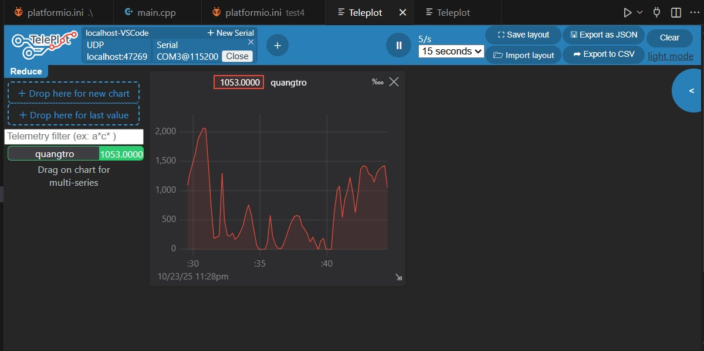

# prj3

Dự án: Đo và Hiển Thị Cường Độ Ánh Sáng Bằng ESP32 và Quang Trở
1. Mục tiêu
Đọc giá trị ánh sáng từ cảm biến quang trở (LDR) qua chân ADC của ESP32.
Gửi giá trị (0–4095) ra UART để theo dõi trên Serial.
Hiển thị đồ thị giá trị ánh sáng theo thời gian bằng Teleplot.
2. Công cụ 
ESP32 DevKit, LDR + điện trở, Breadboard, dây nối
3. Hiển thị đồ thị
Cài Teleplot extension trong VS Code.
Mở tab Teleplot → Connect Serial → chọn COM của ESP32 (115200).
Quan sát đồ thị biến quangtro thay đổi theo ánh sáng môi trường.
4. Kết luận
ESP32 đọc tín hiệu từ LDR qua ADC và gửi dữ liệu tới Teleplot giúp quan sát biến thiên cường độ sáng theo thời gian thực, ứng dụng hữu ích trong các hệ thống IoT và cảm biến môi trường.
